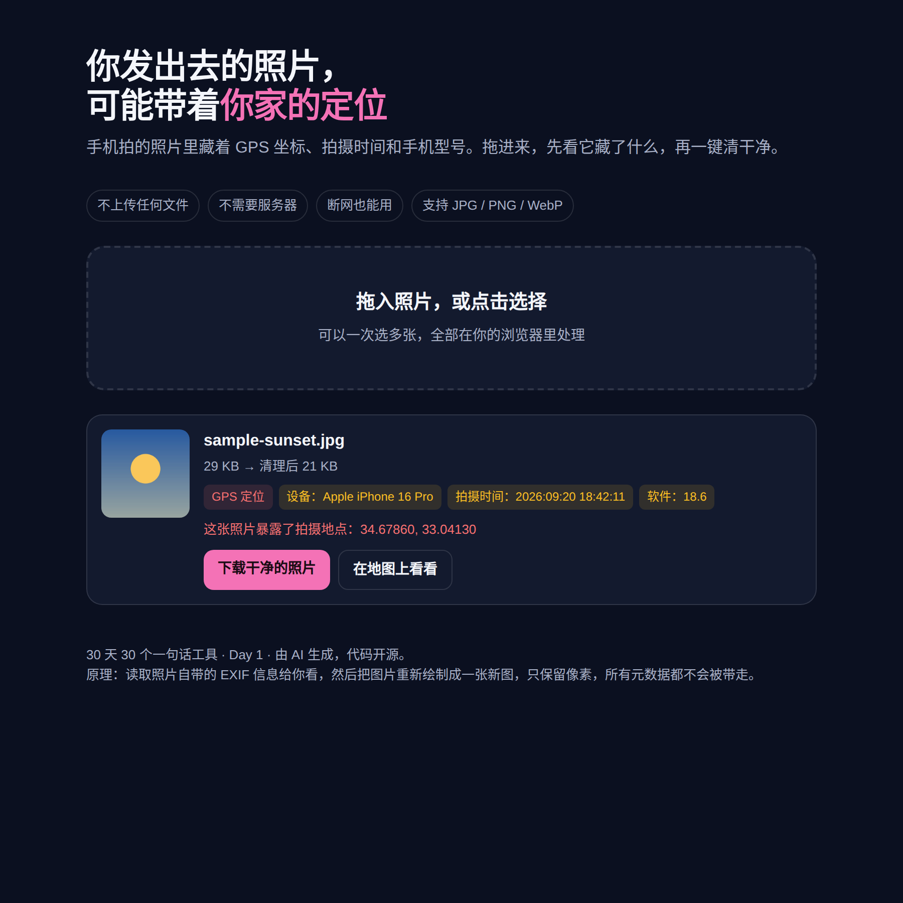

# Day 1 · 照片隐私清理器

30 天 30 个一句话工具，第 1 天。

手机拍的照片里藏着 GPS 坐标、拍摄时间和手机型号，发到网上就可能暴露你家在哪。这个工具先把照片里藏的信息读出来给你看，再一键生成一张“干净”的照片。

- 不上传任何文件，全部在浏览器里完成
- 不需要服务器，断网也能用
- 单个 HTML 文件，零依赖

## 那一句话

> 做一个纯浏览器端的照片隐私清理器：拖入照片，先把 EXIF 里的 GPS 定位、设备型号、拍摄时间读出来展示给用户，再一键导出去掉所有元数据的干净照片，不上传、不联网、单个 HTML 文件。

## 原理

1. 读取 JPEG 的 APP1 段，解析 TIFF 结构，拿到 IFD0、Exif 和 GPS 三组信息。
2. 用 `createImageBitmap` 按照片方向解码，画到 canvas 上，再导出成新文件。新文件只有像素，所有元数据都不会被带过去。

## 预览

## 使用

在线使用：https://licorne26.github.io/30-days-30-tools/day01-photo-privacy-cleaner/

也可以下载 `index.html`，双击用浏览器打开，断网也能用。

## 局限

- 重新编码 JPEG 会有轻微的画质损失（质量 0.92，肉眼基本看不出）。
- 只解析 JPEG 的 EXIF；PNG 和 WebP 不展示信息，但同样会被清理干净。
