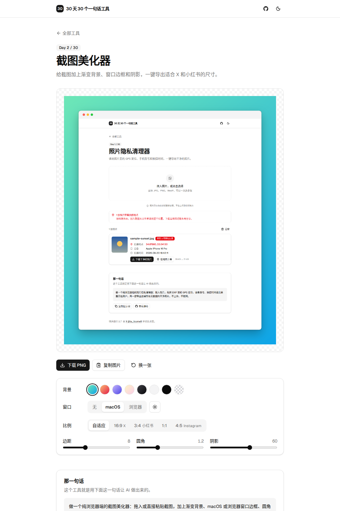

# Day 2 · 截图美化器

在线使用：https://licorne26.github.io/30-days-30-tools/day02-screenshot-beautifier/

发产品截图、代码截图的时候，直接贴原图总显得很随意。这个工具给截图加上渐变背景、macOS 或浏览器窗口边框、圆角和阴影，还能一键切到 X（16:9）、小红书（3:4）这些发帖比例。

- 截完图直接 ⌘V / Ctrl V 粘贴，不用先存文件
- 下载 PNG，或者直接复制到剪贴板贴进发帖框
- 不上传任何文件，全部在浏览器里完成

## 那一句话

> 做一个纯浏览器端的截图美化器：拖入或直接粘贴截图，加上渐变背景、macOS 或浏览器窗口边框、圆角和阴影，可以选 16:9、3:4 等发帖比例，预览和导出用同一套 canvas 绘制，一键下载 PNG 或复制到剪贴板，不上传、不联网。

## 预览

## 原理

1. `render.ts` 只有一个 `render(canvas, image, options)` 函数：先按截图宽度算出边距、标题栏高度和目标比例，再依次画背景、阴影、窗口、截图。
2. 页面上的预览和下载的 PNG 用的是同一个 canvas，所以看到什么就导出什么。
3. 所有尺寸都按截图宽度的比例计算，截图多大，窗口按钮和阴影就跟着放大，不会糊。

## 局限

- 导出的长边最大 4096 像素，超过会等比缩小。
- 浏览器边框里的网址只是文字，不会真的去打开。
