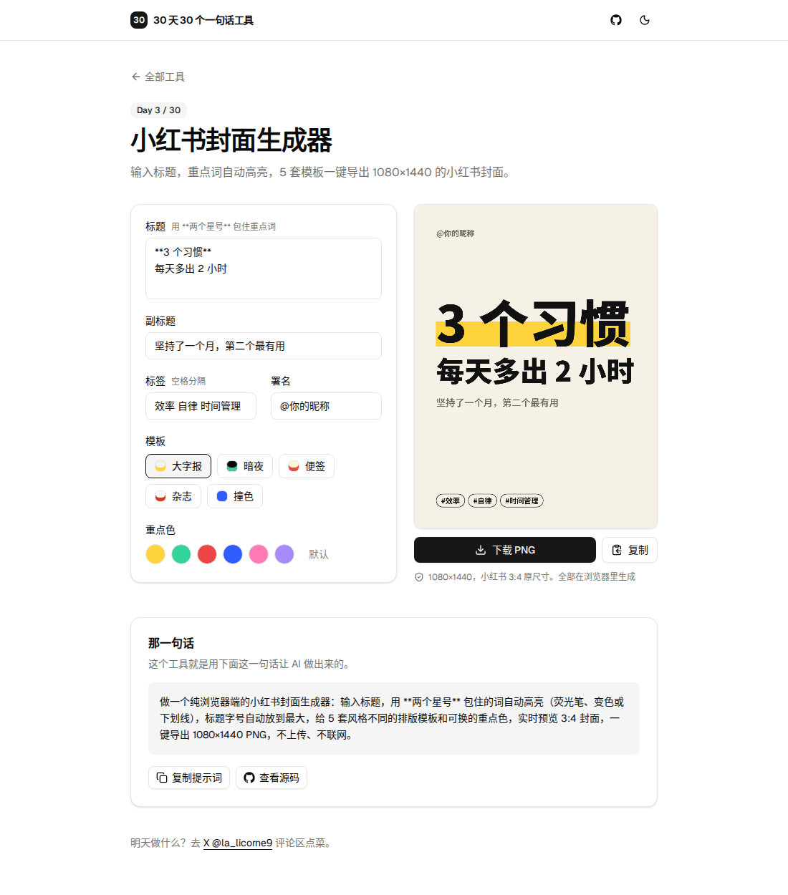

# Day 3 · 小红书封面生成器

在线使用：https://licorne26.github.io/30-days-30-tools/day03-xhs-cover/

小红书上，封面决定了别人点不点进来。大字、重点词高亮、干净的排版就够用，但每次都开设计软件太麻烦。这个工具输入标题就出图。

- 用 `**两个星号**` 包住重点词，自动变成荧光笔、变色或下划线
- 每一行标题单独放到最大，像海报一样；标题太长就自动换行
- 5 套模板：大字报、暗夜、便签、杂志、撞色，重点色可以换
- 直接导出 1080×1440，小红书 3:4 原尺寸
- 不上传、不联网，全部在浏览器里生成

## 那一句话

> 做一个纯浏览器端的小红书封面生成器：输入标题，用 **两个星号** 包住的词自动高亮（荧光笔、变色或下划线），标题字号自动放到最大，给 5 套风格不同的排版模板和可换的重点色，实时预览 3:4 封面，一键导出 1080×1440 PNG，不上传、不联网。

## 预览

## 原理

1. `render.ts` 先把标题拆成排版单位：一个汉字、或者一个英文单词 / 数字，`**` 之间的部分标记为高亮。
2. 每一行按宽度算出能放下的最大字号，行与行之间最多相差 1.8 倍；总高度超出就等比缩小。有一行实在太长，就改用统一字号自动换行，并避免标点出现在行首。
3. 标题和副标题作为一组，在可用区域里偏上居中；标签固定在底部。
4. 预览和导出用的是同一个 1080×1440 的 canvas。

## 局限

- 用的是系统字体（苹果上是苹方，Windows 上是微软雅黑），不同电脑上字形略有差别。
- 标题最多按 5 行排，更长的内容建议放进正文。
