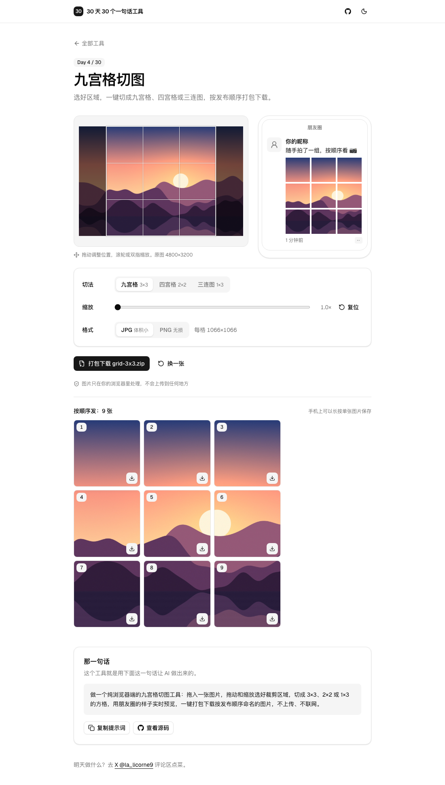

# Day 4 · 九宫格切图

在线使用：https://licorne26.github.io/30-days-30-tools/day04-grid-splitter/

发朋友圈、小红书想拼一张大图，得先把图切成九宫格，还得记住哪张先发。这个工具拖入图片，选好区域，直接按发布顺序打包下载。

- 拖入、点击选择，或者直接 ⌘V / Ctrl V 粘贴图片
- 三种切法：3×3 九宫格、2×2 四宫格、1×3 三连图
- 拖动平移，滚轮、双指或滑块缩放，裁剪框永远被图片填满，不会切出空白
- 旁边是朋友圈样式的实时预览，格子之间留着和真实一样的缝
- 每格最大 1080×1080，可选 JPG 或 PNG；原图不够大会提醒
- 一键打包成 `grid-3x3.zip`，里面是 `01.jpg` 到 `09.jpg`，按发布顺序编号；也可以单张下载，手机上长按保存
- 不上传、不联网，全部在浏览器里切

## 那一句话

> 做一个纯浏览器端的九宫格切图工具：拖入一张图片，拖动和缩放选好裁剪区域，切成 3×3、2×2 或 1×3 的方格，用朋友圈的样子实时预览，一键打包下载按发布顺序命名的图片，不上传、不联网。

## 预览

## 原理

1. 用 `createImageBitmap(file, { imageOrientation: 'from-image' })` 解码，手机竖拍的照片按 EXIF 方向转正。再生成一张长边 2048 的缩小版，只给屏幕上的舞台和预览用，8000px 的大图拖起来也不卡。
2. `crop.ts` 只有纯函数：裁剪框用“缩放倍数 + 中心点在原图上的位置”表示，缩放 1 倍就是原图里能放下的最大裁剪框，所以永远不会出现空白。给定图片尺寸和切法，它算出每一格在原图上的源矩形。舞台、朋友圈预览和导出都用这同一套计算。
3. 拖拽用 Pointer Events，一根手指平移，两根手指按距离变化缩放，缩放时手指下面那一点不动。
4. 导出时每一格直接从原图的源矩形 `drawImage` 到 1080×1080 的 canvas，不经过放大的中间图，所以不损失清晰度。
5. 用 [fflate](https://github.com/101arrowz/fflate) 在浏览器里打 zip，图片本身已经压缩过，所以只存储不再压缩，几乎瞬间完成。

## 局限

- 不支持 HEIC，iPhone 照片请先导出为 JPG，或者从相册分享时选“最兼容”。
- 手机 Safari 下载 zip 不太方便，建议在下面的列表里长按单张图片保存。
- 导出会去掉原图的 EXIF 信息（包括定位），这通常是好事。
