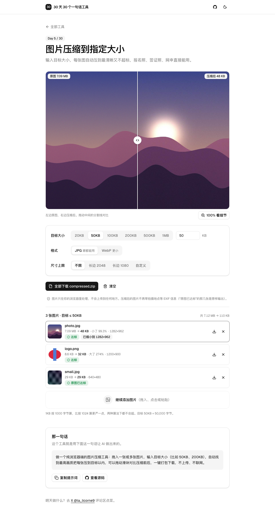

# Day 5 · 图片压缩到指定大小

在线使用：https://licorne26.github.io/30-days-30-tools/day05-image-compressor/

报名照要求 50KB 以内，签证照不超过 200KB，网申系统动不动就“文件过大”。一般的压缩工具只能拖画质滑块，压完看一眼大小，不行再来一次。这个工具直接输入目标大小，每张图自动找到不超标的最高画质。

- 拖入、点击选择，或者直接 ⌘V / Ctrl V 粘贴，一次可以多张（JPG、PNG、WebP）
- 目标大小：20KB、50KB、100KB、200KB、500KB、1MB，也可以手填任意 KB
- 输出 JPG 或 WebP；透明 PNG 转 JPG 时透明部分铺白底，不会变黑
- 可选尺寸上限：不限、长边 2048、长边 1080，或者自定义像素
- 每张图一行：`原大小 → 新大小`、压缩比例、输出分辨率。达标标绿；为了达标缩小了分辨率会写明“已缩小到 W×H”；实在压不到（比如目标 5KB）会标红并显示实际大小
- 原图本来就比目标小、格式也对，就原样输出，标“原图已达标”
- 点列表里任意一张，上方拖动分割线对比压缩前后，可以切到 100% 看细节
- 一键打包成 `compressed.zip`，文件名是 `原文件名-50KB.jpg`；也可以单张下载
- 不上传、不联网，全部在浏览器里压

## 那一句话

> 做一个纯浏览器端的图片压缩工具：拖入一张或多张图片，输入目标大小（比如 50KB、200KB），自动找到最高画质把每张压到目标以内，可以拖动滑块对比压缩前后，一键打包下载，不上传、不联网。

## 预览

## 原理

1. 所有解码和编码都在 Web Worker 里做（`compress.worker.ts`），多张图排队一张一张处理，页面始终能点。改了目标大小或格式，正在处理的那张直接丢掉，按新设置重新排队。
2. `createImageBitmap(file, { imageOrientation: 'from-image' })` 解码，手机竖拍的照片按 EXIF 方向转正，再按“尺寸上限”缩放。
3. 在当前分辨率下对 quality 做二分查找：先试 0.35 和 0.95 两端，再在中间对半找，每个分辨率最多编码 8 次，用 `OffscreenCanvas.convertToBlob` 找出不超过目标的最高 quality。
4. 如果 quality 0.35 还超标，就把分辨率乘 0.85 再找，直到达标或长边小于 320px。文件大小最多和像素数同比例下降，所以可以按这个比例一次跳过几档明显不可能的尺寸，但不会跳过任何可能达标的尺寸。
5. 缩小时用 `imageSmoothingQuality = 'high'`，缩得多时先缩到 2 倍再缩到目标，细线不会出锯齿。每次都从原图缩，不会越缩越糊。
6. `compress.ts` 里的搜索（`findQuality`、`search`）只接收一个 `encode` 函数，不碰 canvas，可以脱离浏览器单独测试。
7. 对比视图是两张叠在一起的图，上面那张用 `clip-path` 按分割线位置裁掉左半边；拖动用 Pointer Events，鼠标和触屏都能拖。
8. 用 [fflate](https://github.com/101arrowz/fflate) 在浏览器里打 zip，图片本身已经压缩过，所以只存储不再压缩。

## 局限

- 1KB 按 1000 字节算，比按 1024 算更严一点，所以不管对方系统用哪种算法都不会超。
- 不支持 HEIC，iPhone 照片请先导出为 JPG，或者从相册分享时选“最兼容”。
- 有的浏览器（比如 Safari）的 canvas 导出不了 WebP，这时 WebP 选项是灰的，用 JPG 就行。
- 压缩后的图片不再带拍摄地点等 EXIF 信息，这通常是好事。“原图已达标”的那几张是原样输出，EXIF 还在，介意的话可以先用 [Day 1 照片隐私清理器](../day01-photo-privacy-cleaner/) 清一遍。
- 透明 PNG 选 WebP 会保留透明；选 JPG 会铺白底。
