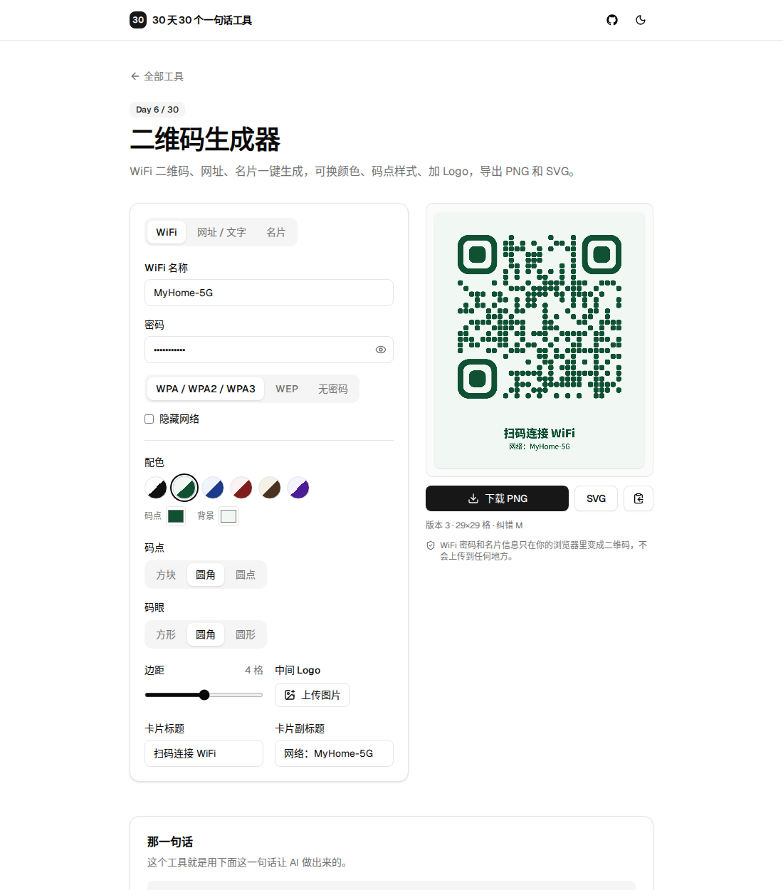

# Day 6 · 二维码生成器

在线使用：https://tools.licorne.uk/day06-qr-code/

家里来客人，最常被问的一句是“WiFi 密码多少”。念一遍大小写和数字，对方还经常输错。做一张 WiFi 二维码贴在墙上，手机相机一扫就连上。网上的二维码生成器大多要把内容发到服务器，而 WiFi 密码恰恰是最不该上传的东西，所以这个工具全部在浏览器里生成。

- 三种内容：WiFi（扫码直接连网）、网址 / 任意文字、名片（扫码保存到通讯录）
- WiFi 支持 WPA / WPA2 / WPA3、WEP、无密码，以及隐藏网络；名称和密码里的 `; , : " \` 会自动转义，不会扫出错的密码
- 6 套配色，也可以自己选码点和背景颜色；颜色太接近或者用了反色，会提示可能扫不出来
- 码点：方块、圆角、圆点；码眼：方形、圆角、圆形
- 中间可以放 Logo，放了之后自动切到最高纠错等级（H），保证挡住中间也能扫
- 二维码下面可以加标题和副标题，WiFi 模式默认是“扫码连接 WiFi / 网络：名称”，改过就按你写的来
- 导出高清 PNG（约 2200px 宽，打印够用）和 SVG，也可以直接复制图片
- 不上传、不联网

## 那一句话

> 做一个纯浏览器端的二维码生成器：支持 WiFi（扫码直接连网）、网址文字和名片三种内容，可以换配色、码点和码眼样式、在中间加 Logo、在下面加一行说明文字，实时预览，导出高清 PNG 和 SVG，WiFi 密码不上传、不联网。

## 预览

## 原理

1. `payload.ts` 把表单变成二维码里的文字：WiFi 用手机相机都认的 `WIFI:T:WPA;S:名称;P:密码;;` 格式，名片用 vCard 3.0。
2. 编码用 [uqr](https://github.com/unjs/uqr)（几 KB、没有依赖），中文按 UTF-8 编码。它会标出每个格子属于哪一部分，所以三个定位角（码眼）可以单独画成圆角或圆形。
3. `render.ts` 先把整张卡片描述成一组形状（矩形、圆、文字、Logo），画布预览、PNG 导出和 SVG 导出都画同一组形状，所以三者完全一致。
4. 放了 Logo 时，中间一块格子留空不画，靠 H 级纠错（可恢复约 30%）还原。Logo 只占 22% 宽度，面积不到 5%，留足了余量。

测试时把所有码点和码眼的组合、带特殊字符的 WiFi 密码、带 Logo 的码、中文网址和中文名片都导出成 PNG，用 ZXing 解码，内容全部一致；缩到 240px 宽也都能识别。

## 局限

- 圆形码眼在部分老手机相机上识别会慢一点，要打印贴出去的话，稳妥起见选方形或圆角码眼。
- 名片里的中文姓名整个放在“姓”字段里，导入通讯录后显示正常，但不会拆分姓和名。
- 标题和副标题用系统字体，PNG 在不同电脑上导出，字形会略有差别；SVG 在没有中文字体的环境里打开可能显示为方框。
