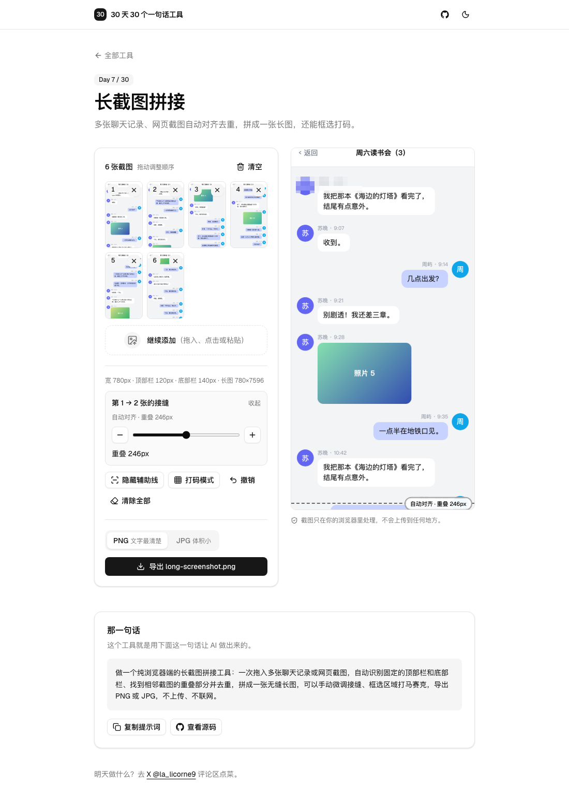

# Day 7 · 长截图拼接

在线使用：https://tools.licorne.uk/day07-screenshot-stitcher/

聊天记录、长网页一屏截不完，只能截好几张发过去，对方得一张张翻，顺序还容易乱。这个工具把多张截图拼成一张长图：自动认出每张都有的标题栏和输入栏，找到相邻两张重叠的部分去掉重复，接缝看不出来。顺手还能把名字、头像框起来打上马赛克。

- 拖入、点击多选，或者 ⌘V / Ctrl V 一张张粘贴；默认按文件名里的数字排序（截图 2 在截图 10 前面），没有数字就按修改时间
- 缩略图可以拖动调整顺序（鼠标、手指都行），也可以单张删除
- 自动识别固定的顶部栏和底部栏，长图里只留第一张的顶部栏和最后一张的底部栏
- 自动找相邻截图的重叠部分并去重；找不到重叠的接缝直接首尾相接，并标出“没找到重叠，已直接拼接”
- 宽度不一样的截图，统一缩放到大多数截图的宽度
- 预览里每个接缝有一条辅助虚线和标签（“自动对齐 · 重叠 246px”），可以隐藏；点标签可以用 −/＋ 或滑块逐像素微调重叠（±200px）
- 打码模式：在长图上拖出矩形就变成马赛克，格子大小随图片宽度变化；可以撤销、清除全部。只改导出的图，不改原图
- 导出 PNG 或 JPG。长图超过浏览器画布的安全尺寸（超过 1600 万像素或高度超过 16000px）时，自动分成几张打包成 `long-screenshot.zip`
- 不上传、不联网

## 那一句话

> 做一个纯浏览器端的长截图拼接工具：一次拖入多张聊天记录或网页截图，自动识别固定的顶部栏和底部栏、找到相邻截图的重叠部分并去重，拼成一张无缝长图，可以手动微调接缝、框选区域打马赛克，导出 PNG 或 JPG，不上传、不联网。

## 预览

## 原理

1. **行特征**：在 Web Worker 里用 `OffscreenCanvas` 把每张截图缩放到统一宽度、读出像素，然后把每一行压缩成 64 个灰度值（这一行切成 64 段，每段取平均）。左右各 4% 不算，避开滚动条和屏幕圆角。后面的比较都只用这些行特征，一张截图几千行也只是几十万个数，20 张截图在 Worker 里一秒左右就对齐完，页面不卡。
2. **固定栏**：从顶部开始一行行往下比，如果所有截图的这一行都几乎一样（平均灰度差 ≤ 2.5，单段差 ≤ 16），就算顶部栏，直到第一行不一样为止；底部栏从最后一行往上同样比。每个固定栏最多占截图高度的 35%。宽度不一致时，只用原本就是这个宽度的截图来判断，缩放过的截图像素对不齐，会把固定栏误判得太短。
3. **找重叠**：去掉固定栏后，对相邻两张截图，试每一个重叠高度 k（至少 40px）：上一张最后 k 行和下一张最前 k 行逐行比较。只比较“有内容”的行（这一行最亮和最暗的段相差超过 12），因为聊天背景的空白行和什么都能对上，会让错位也显得很像。平均差 ≤ 5 才算对上，几乎一样好的候选里选 k 最大的那个（滚动截图的真实重叠通常就是最大的那个）。先用每行的平均灰度做一遍粗筛，它一定不会大于逐段比较的差值，所以不会漏掉正确答案，又能很快排除绝大多数 k。
4. **排版**：`stitch.ts` 的 `layout` 算出每张截图取哪几行、放到长图的什么位置：第一张保留顶部栏，最后一张保留底部栏，中间每张跳过“顶部栏 + 重叠”那几行。预览、打码和导出都按这同一个结果来画。
5. **预览**：长图可能有几万像素高，预览不画整张，只用一块跟可视区域一样大的画布，滚动到哪儿就画哪一段，所以多长都流畅，也不会碰到画布尺寸上限。
6. **打码**：矩形用长图坐标保存。马赛克的格子按长图原点对齐，分段导出时切口也落在格子边上，所以跨段的打码区域和一整张导出时完全一样。
7. 分段打包用 [fflate](https://github.com/101arrowz/fflate)，图片本身已经压缩过，只存储不再压缩。

测试时用一个虚构的聊天页面（顶部标题栏、底部输入栏、中间 40 条消息，有图片占位块），按每次滚动约 70% 屏高截了 6 张，再把整页一次渲染出来作为标准答案：拼出来的长图和标准答案尺寸一致，逐像素平均差异 0。打乱顺序后拖回正确顺序、两张完全不重叠的截图、其中一张宽度不同（平均差异 0.17）、打码区域、25 张截图自动分成 2 张打包，也都逐项检查过。

## 局限

- 截图里如果有会变的东西停在固定位置（比如每张时间都不同的状态栏），它不会被当作固定栏，接缝处可能多出一截；这时可以点接缝标签手动调整。
- 内容完全重复的区域（比如连续几条一模一样的消息）可能对不准，同样可以手动微调。
- 打码区域按长图坐标保存，调整顺序或重叠量之后，已经打的码不会跟着内容移动，最好最后再打码。
- 手机上缩略图区域按住就是拖动，要滚动页面请在缩略图以外的地方滑动；打码模式下预览区也不能滑动，关掉打码模式就可以。
