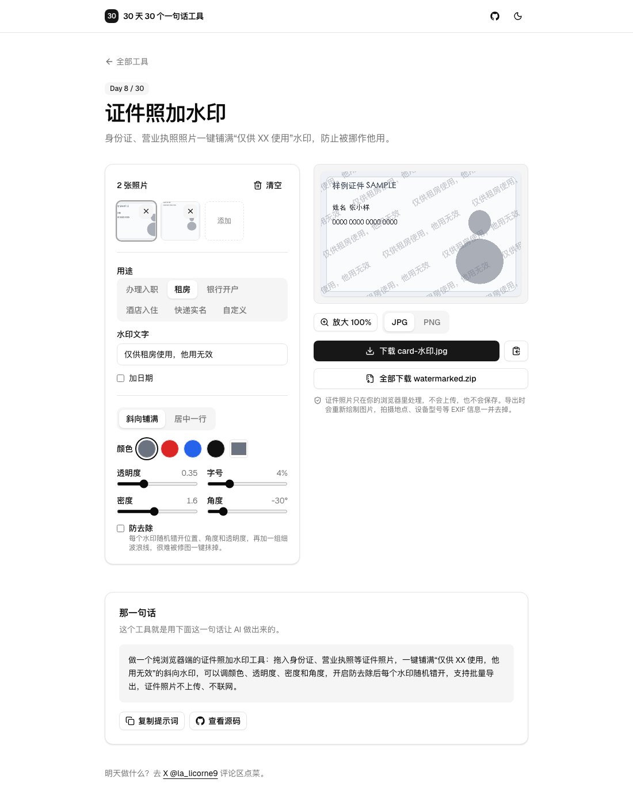

# Day 8 · 证件照加水印

在线使用：https://tools.licorne.uk/day08-id-watermark/

租房、办入职、银行开户，经常要把身份证、营业执照拍照发给别人。照片一旦发出去，就可能被拿去办别的事，事后很难说清。给证件照铺满一层“仅供租房使用，他用无效”，至少让被挪用变得更难。这个工具全部在浏览器里处理，证件照片不会上传。

- 拖入、点击多选，或者 ⌘V / Ctrl V 粘贴（JPG、PNG、WebP），所有图片共用一套水印设置，点缩略图切换预览
- 用途预设：办理入职、租房、银行开户、酒店入住、快递实名、自定义；生成的整句话可以直接改，还可以加上当天日期
- 模式：斜向铺满（默认）或居中一行；颜色灰、红、蓝、黑或自定义；透明度、字号、密度、角度（-45° 到 45°）都能调
- 防去除：每个水印的位置（±8%）、角度（±3°）和透明度（±0.05）随机抖动，再加一组很细的波浪线。用固定随机种子，预览和导出完全一样
- 预览可以放大到 100% 看细节
- 导出 JPG（质量 0.92）或 PNG，分辨率和原图一致，文件名 `原文件名-水印.jpg`；单张下载、复制到剪贴板，多张打包成 `watermarked.zip`
- 导出时重新解码、重新绘制，拍摄地点、设备型号等 EXIF 信息都不会带出去
- 不上传、不联网、不保存

## 那一句话

> 做一个纯浏览器端的证件照加水印工具：拖入身份证、营业执照等证件照片，一键铺满“仅供 XX 使用，他用无效”的斜向水印，可以调颜色、透明度、密度和角度，开启防去除后每个水印随机错开，支持批量导出，证件照片不上传、不联网。

## 预览

## 原理

1. `watermark.ts` 只有一个绘制函数 `drawWatermark(ctx, 宽, 高, 选项, 种子)`，预览（缩小的画布）和导出（原尺寸画布）都调用它。字号、间距、抖动幅度全都按图片宽度的比例算，所以缩略预览和导出的效果一致。
2. 斜向铺满时，先把整个网格绕图片中心旋转，再按“对角线长度的一半加一个文字宽度”算出行列数，旋转任意角度后四个角都不会漏；相邻两行错开半个文字宽度，文字互相咬合。
3. 防去除用 mulberry32 伪随机数，种子固定，每个水印按固定顺序取随机数，所以同一张图每次预览、导出都一模一样；不同位置的水印互不相同，没法用一张“水印模板”整体减掉。
4. 用 `createImageBitmap(file, { imageOrientation: 'from-image' })` 解码，手机竖拍的照片按方向转正。预览只用最长边 1600px 的缩小版，导出才用原图。
5. 导出是把解码后的像素重新画到新画布再编码，原文件里的 EXIF 不会被复制过去。zip 用 [fflate](https://github.com/101arrowz/fflate)，图片已经压缩过，只存储不再压缩。

测试时用虚构的样例证件（1600×1000 横图、3000×4000 竖图）：导出尺寸和原图一致；切成 4×4 共 16 块，每一块都有水印，四个角也没有漏；防去除开启后两次导出完全一致；居中模式只改变中间区域；原图里的 GPS 信息在导出里不存在。

## 局限

- 水印只能增加被挪用的难度，不能代替官方的防伪手段。有经验的人可以靠修图软件尽量去掉水印，所以证件照还是尽量只发给可信的对方，并写明用途。
- 水印会盖住一部分证件内容，调透明度和字号时要保证证件上的信息仍然看得清。
- 不支持 HEIC，iPhone 照片请先导出为 JPG，或者从相册分享时选“最兼容”。
- 超大的图片（几千万像素）在手机上导出可能比较慢，或者超出浏览器画布的上限。
