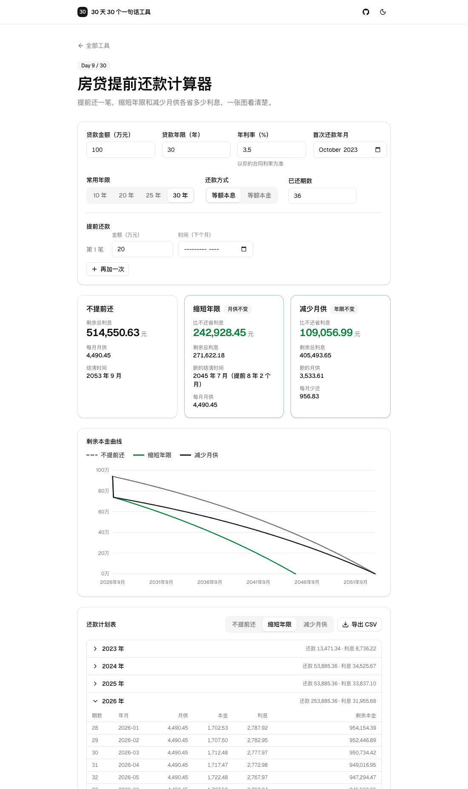

# Day 9 · 房贷提前还款计算器

在线使用：https://tools.licorne.uk/day09-mortgage-prepay/

手里有一笔钱，想提前还一部分房贷：是月供不变、早点还完，还是年限不变、每月少还一点？两种做法各省多少利息，光靠想很难算清。这个工具把两种方案同时算出来，用一张曲线对比剩余本金，还给出完整的还款计划表。所有计算都在浏览器里完成。

- 贷款金额（万元）、年限（预设 10 / 20 / 25 / 30 年）、年利率（自己填，以合同利率为准）、等额本息或等额本金、首次还款年月、已还期数（默认按今天自动算，可改）
- 提前还款：金额和时间（默认下个月，可选具体年月），最多 3 笔，按时间顺序依次计算
- 三张结果卡片：不提前还 / 缩短年限 / 减少月供。每张都有剩余总利息，两种提前还款方案还有“比不还省多少利息”、新的结清时间或月供；数字变化时会滚动
- 剩余本金曲线：三条线，悬停（手机上按住）显示那个月三种方案的剩余本金
- 还款计划表：按方案切换，按年折叠；提前还款的那一期会高亮；可导出 CSV（带 BOM，Excel 打开中文不乱码）
- 所有输入都保存在网址参数里，刷新或分享链接就能还原
- 不上传、不联网

## 那一句话

> 做一个纯浏览器端的房贷提前还款计算器：输入贷款金额、年限、利率、还款方式和已还期数，再填提前还款的金额和时间，同时算出“月供不变、缩短年限”和“年限不变、减少月供”两种方案各省多少利息，用曲线对比剩余本金，给出完整还款计划表，可以导出表格，不上传、不联网。

## 预览

## 原理

记贷款本金 P，总期数 n（年限 × 12），月利率 r = 年利率 ÷ 12，每月一期。

1. **等额本息**：每月还款额相同，`M = P·r·(1+r)^n / ((1+r)^n − 1)`。每期利息 = 剩余本金 × r，本金 = M − 利息。
2. **等额本金**：每期本金固定 `P / n`，利息按剩余本金计算，所以月供逐月递减，每月约少 `P/n·r`。
3. **提前还款**：在当月正常还款之后，一次性还入一笔，直接冲减剩余本金 B（超过 B 就按 B 算）。已还期数以内的各期按原计划计算，之后才套用提前还款。
4. **缩短年限（月供不变）**：等额本息继续还原来的 M，等额本金继续还原来的每期本金，所以剩余本金归零得更早，最后一期按实际剩余结清。
5. **减少月供（年限不变）**：剩余期数 `n' = n − t` 不变，按新的剩余本金 B 重新算：等额本息 `M' = B·r·(1+r)^n' / ((1+r)^n' − 1)`，等额本金每期本金 `B / n'`。
6. 计算全程不做四舍五入，只在显示时保留两位小数。曲线是自己用 SVG 画的，没有图表库。

测试时对照公认结果：100 万、30 年、4.9%、等额本息，月供 5307.27，总利息 910,616.19；等额本金首月 6861.11，每月递减约 11.34。提前还款金额为 0 时两种方案与“不提前还”完全一致；全部还清时两种方案都在那一期结清；每个方案的本金之和加提前还款总额等于贷款金额；同一笔还款，缩短年限省的利息不少于减少月供。

## 局限

- 银行的实际计息方式（按日计息、利率调整日、舍入规则、提前还款的违约金等）可能不同，结果仅供估算，以银行为准。
- 只支持固定利率，没有处理利率中途调整（LPR 重定价）。
- 提前还款按“当月正常还款之后”处理，和你实际的还款日、提前还款的预约规则可能差几天。
- 本工具只做计算，不构成任何理财或贷款建议。
