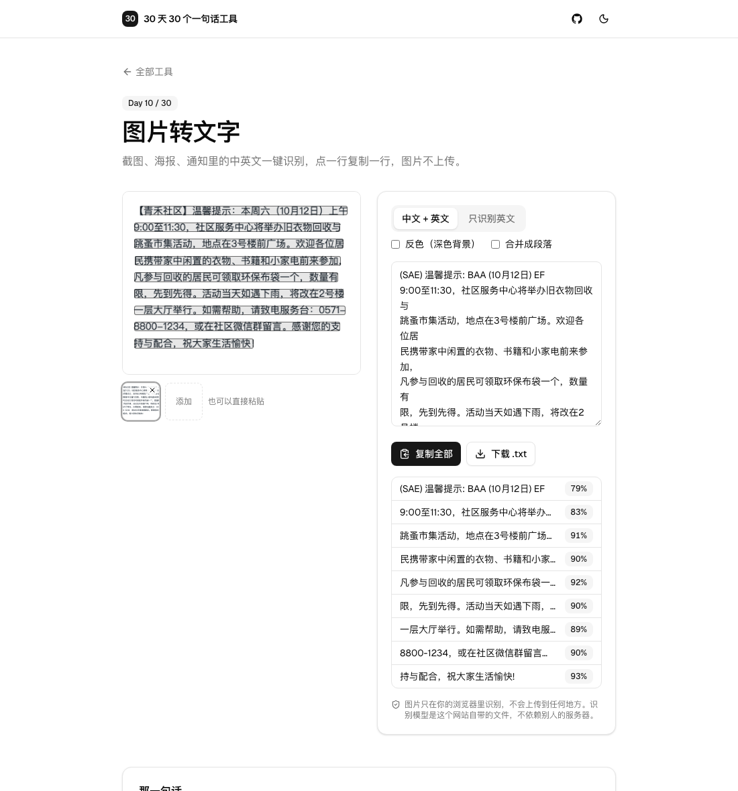

# Day 10 · 图片转文字

在线使用：https://tools.licorne.uk/day10-image-to-text/

通知、海报、聊天截图里的文字，想复制出来只能一个字一个字地敲。网上的识别工具大多要把图片传到服务器，证件、合同、聊天记录这类图片恰恰最不该上传。这个工具把识别引擎和模型都放在网站里，全部在浏览器里识别。

- 截完图直接 ⌘V / Ctrl V 粘贴，也可以拖入或点击选择（JPG、PNG、WebP）；一次处理一张，左下角保留最近 6 张的缩略图，可以切回
- 语言：中文 + 英文（默认）或只识别英文
- 第一次识别时显示模型下载进度（约 6.6 MB），之后缓存，不再下载
- 原图上用半透明框标出每一行，鼠标悬停高亮，点一下复制这一行并提示“已复制”；右侧文本框里同一行会被选中
- 置信度低于 75% 的行用黄色标出，提示“这一行可能不准，请核对”；每一行的置信度都列在文本框下面
- 右侧是可编辑的文本框，可以复制全部、下载 `.txt`；“合并成段落”按行距把同一段的换行去掉，中文之间不加空格，英文之间加空格
- 预处理：短边小于 800px 的图先放大 2 倍，转灰度；深色背景的截图可以勾选“反色”
- 不上传、不联网

## 那一句话

> 做一个纯浏览器端的图片转文字工具：拖入或粘贴截图、照片，在浏览器里识别出中英文文字，原图上框出每一行、点一下就能复制，识别结果可以编辑后一键复制全部，识别模型放在网站里随页面加载，图片不上传。

## 预览

## 原理

1. **引擎**：[tesseract.js](https://github.com/naptha/tesseract.js) 7（Tesseract 的 WebAssembly 版，LSTM 识别），模型用 [tessdata_fast](https://github.com/tesseract-ocr/tessdata_fast) 的 `chi_sim`（2.4 MB）和 `eng`（4.1 MB）。
2. **全部自托管**：识别用的 worker、wasm 内核（`tesseract.js-core`，三个 SIMD 档位）和两个语言模型都放在这个仓库的 `public/` 里，页面只从自己的网站取文件，不依赖任何第三方 CDN。语言模型下载后由 tesseract.js 存进浏览器的 IndexedDB，第二次打开不会再下载。
3. **预处理** `ocr.worker.ts`：在 Web Worker 里用 `OffscreenCanvas` 放大、转灰度、反色；透明 PNG 先铺白底。识别本身也在 tesseract.js 自己的 worker 里，界面不会卡。
4. **解码** 用 `createImageBitmap(file, { imageOrientation: 'from-image' })`，手机竖拍的照片会转正。识别框的坐标除以放大倍数，换算回原图像素，再按百分比叠在图上，所以图片缩放时框始终对得上。
5. **整理文字** `ocr.ts`：引擎会在中文字之间插空格，这里去掉；段落按行距划分——和相邻行的间隙明显大于正常行距的地方才分段（引擎自己的分段在均匀行距的通知上不稳定，没有采用）。

## 许可证和体积

| 组件 | 许可证 | 新增体积 |
| --- | --- | --- |
| tesseract.js 7（含 worker） | Apache-2.0 | 约 0.1 MB |
| tesseract.js-core 6（三个 wasm 内核） | Apache-2.0 | 约 11.7 MB |
| tessdata_fast `chi_sim` + `eng` | Apache-2.0 | 6.6 MB |

合计约 18 MB，都是静态文件，只在用到时才下载（语言模型约 6.6 MB，引擎内核约 4 MB）。Apache-2.0 允许在 MIT 项目里使用；许可证文件随 `public/tesseract/` 一起放着。

## 准确率测试

用 Playwright 渲染 5 张自己写的虚构内容测试图，字符准确率 = 1 − 编辑距离 / 原文长度（去掉空白后比较）：

| 测试图 | 准确率 |
| --- | --- |
| 手机截图风格的中文通知（约 200 字） | 92.0% |
| 中英混排的网页段落 | 92.7% |
| 深色背景的代码 / 文字截图（勾选“反色”） | 97.3% |
| 14px 的小字号中文段落 | 99.2% |
| 前四张平均 | **95.3%** |
| 带 2° 旋转和噪点的“拍照”效果图 | **96.0%** |

门槛是前四张平均 ≥ 95%、第五张 ≥ 85%，用 tesseract.js 就达到了，所以没有换成 PP-OCR。错得最多的是每段第一行里的全角括号（“【青禾社区】”“（10月12日）”）和中英文交界处。

## 局限

- 手写字、艺术字、竖排文字效果差；背景花哨或对比度很低的图也会漏字。
- 全角括号、书名号和中英文夹杂的地方容易出错，置信度也不一定准（这些行有时仍然显示 80% 以上），重要的内容请核对。
- 只带了简体中文和英文，没有繁体、日文等其他语言。
- 首次使用要下载约 10 MB（引擎和语言模型），网络慢时需要等一会儿；引擎内核靠浏览器的普通 HTTP 缓存，缓存过期后会重新下载。
- 一次只处理一张图片。
