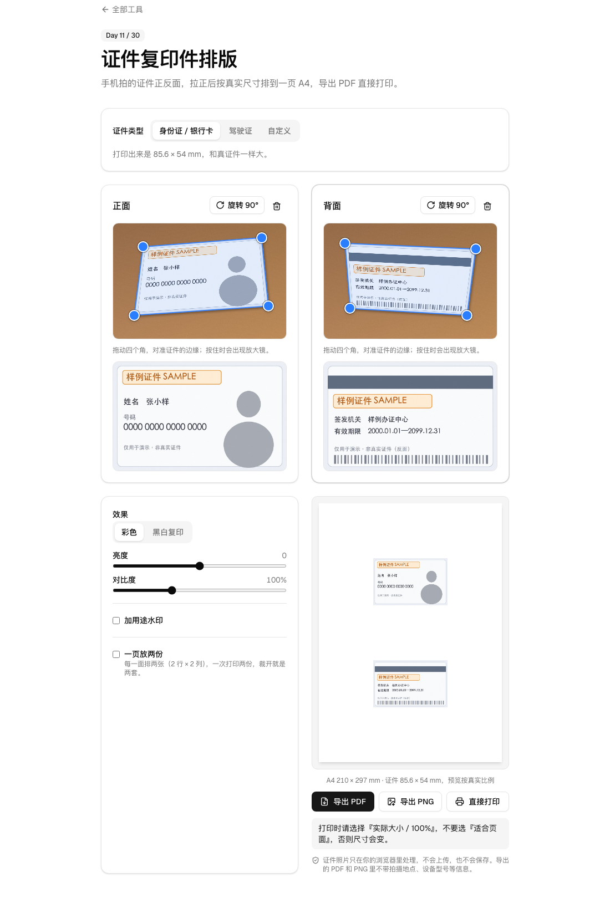

# Day 11 · 证件复印件排版

在线使用：https://tools.licorne.uk/day11-id-copy-a4/

办事常要交证件正反面的复印件，手边没有复印机，手机拍的照片又是歪的。这个工具把正反面照片拉正，按真实尺寸排在一页 A4 上，导出 PDF 直接打印。全部在浏览器里处理，证件照片不会上传。

- 证件类型：身份证 / 银行卡（85.6 × 54 mm，默认）、驾驶证（88 × 60 mm）、自定义宽高（mm）
- 正面、反面两个槽位（可以只放一面）：拖入、点击选择，或 ⌘V / Ctrl V 粘贴；一次选两张图时，第一张进当前槽位，第二张进另一个
- 拖动四个角对准证件边缘：初始在照片内缩 10%；拖动时旁边出现 2.5 倍放大镜；鼠标、触屏都行（Pointer Events），也可以用方向键微调；“旋转 90°”处理横拍竖拍，四个角会跟着转
- 右侧（手机上在下方）实时显示拉正后的结果
- 效果：彩色，或黑白复印（灰度加提高对比度，底色更白）；亮度、对比度两个滑块
- 水印（可选）：用 Day 8 的水印函数，用途预设和 Day 8 一样，铺满整页 A4
- A4 排版预览：竖版，正面在上、反面在下，水平居中、上下均分；可选“一页放两份”（2 行 × 2 列，一次打印两套）；预览按真实比例
- 导出：PDF（`证件复印件.pdf`）、PNG（2480 × 3508，A4 @ 300 dpi）、直接打印；导出按钮下方固定提示“打印时请选择『实际大小 / 100%』，不要选『适合页面』”
- 不上传、不联网

## 那一句话

> 做一个纯浏览器端的证件复印件排版工具：放入手机拍的证件正反面照片，拖动四个角对准证件边缘自动拉正，按真实尺寸排在一页 A4 上，可选黑白复印效果和“仅供 XX 使用”水印，导出 PDF 直接按实际大小打印，证件照片不上传、不联网。

## 预览

## 原理

1. **透视变换** `warp.ts`：拍歪的证件在照片里是一个任意四边形，要映射回一个矩形。由四个角点和目标矩形的四个角解出单应矩阵（homography，8 个未知数、8 个方程，高斯消元求解）。对目标图的每个像素，用矩阵反向算出它在照片里的位置，再用双线性插值取色；照片比目标大很多时每个像素取 2 × 2 个采样再平均，边缘不会有锯齿。
2. **分辨率**：按 300 dpi 输出，像素数 = 毫米数 ÷ 25.4 × 300（85.6 mm → 1011 px，54 mm → 638 px）。界面里的实时结果用 150 dpi，导出时重新按 300 dpi 从原图算一遍。
3. **不卡界面**：照片的完整像素放在 Web Worker 里（`warp.worker.ts`），拖动时主线程只发四个角的坐标；Worker 忙的时候只保留最新一次的坐标，不会排队。
4. **黑白复印**：转灰度后，把 35–205 的亮度范围拉伸到 0–255，浅灰的纸面变白、字迹变深，再叠加亮度和对比度。
5. **A4 尺寸换算** `layout.ts`：页面 210 × 297 mm，PDF 里是 595.28 × 841.89 pt，1 mm = 72 / 25.4 pt。每一列 / 行的空白平分：两张证件上下排时，上、中、下三段空白都是 (297 − 2 × 54) ÷ 3 = 63 mm；一页放两份时左右空白是 (210 − 2 × 85.6) ÷ 3 ≈ 12.9 mm。
6. **PDF**（[pdf-lib](https://github.com/Hopding/pdf-lib)，MIT）：页面严格 A4，每张证件是一张 300 dpi 的 JPEG，按上面的毫米坐标和真实宽高放置。水印是整页的：落在证件上的部分直接画进证件图片，落在空白纸面上的部分是一张盖在页面上的透明 PNG。
7. **直接打印**：生成一个只有 A4 页面图片的隐藏页面，`@page { size: A4; margin: 0 }`，图片宽高写成 210mm × 297mm，然后调起浏览器打印。

## 局限

- 打印机自身有误差，纸张进给、缩放设置不同，打出来的尺寸可能差零点几毫米；务必在打印设置里选“实际大小 / 100%”。
- 拉正的准确度取决于你把四个角放得多准；证件边缘被手指或反光挡住时，拉正后会有一点变形。
- 复印件的法律效力以办理机构的要求为准；有的机构要求原件或加盖“与原件一致”的章，这个工具只负责排版。
- 这个工具不识别证件，也不会检查证件是否完整。
- 一次一套证件；自定义尺寸限制在宽 20–200 mm、高 20–140 mm，一页放不下时会提示。
