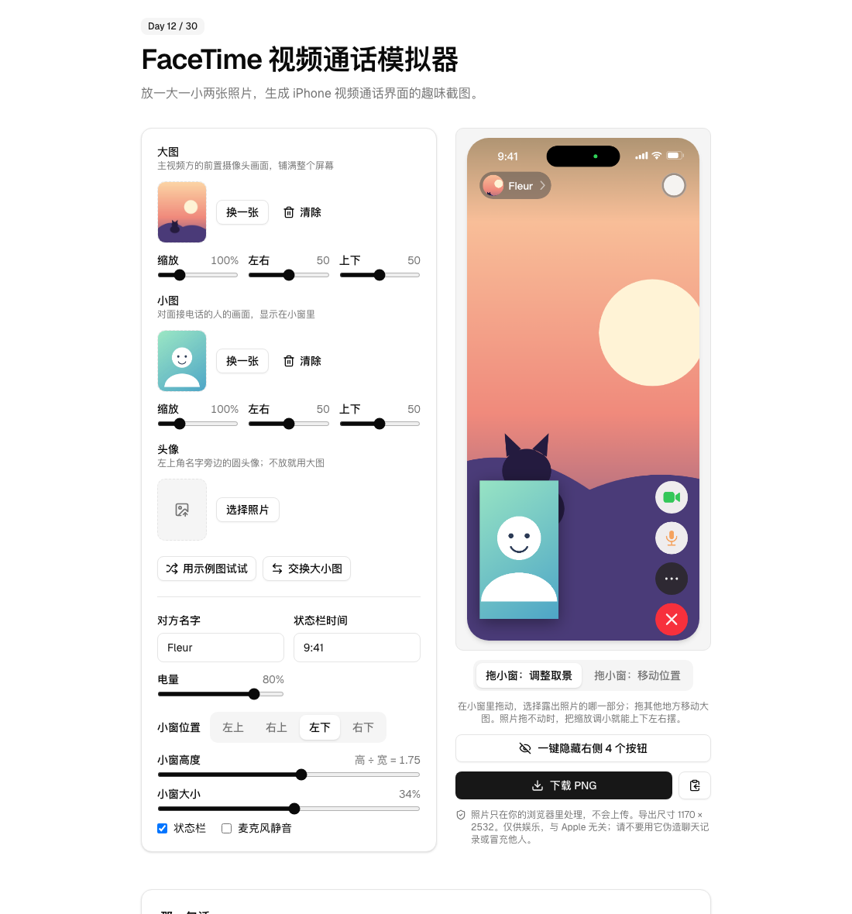

# Day 12 · FaceTime 视频通话模拟器

在线使用：https://tools.licorne.uk/day12-facetime-sim/

放两张照片，生成一张 iPhone 视频通话风格的截图：大图是主视频方的前置摄像头画面，小图是对面接电话的人，缩在小窗里。纯属好玩——和朋友开个玩笑、做个表情包、给故事配一张“来电”配图。全部在浏览器里画，照片不上传。

- 两张照片：拖入、点击选择或 ⌘V / Ctrl V 粘贴（JPG、PNG、WebP）；一次选两张时，第一张是大图，第二张是小图；“交换大小图”一键互换
- 头像：名字旁边的圆头像可以单独上传；不上传就取大图
- 每张照片可以调缩放、左右、上下，决定哪一块露在画面里；也可以直接在预览上拖：在小窗里拖动，选择小窗露出照片的哪一部分；拖其他地方移动大图；切到“拖小窗：移动位置”后，拖小窗就是换位置（四个角按钮也能放回）
- 缩放可以小于 100%：照片比画面小时，空出来的地方用这张照片的模糊放大版填上，所以任何比例的照片（横拍、竖拍）都能上下左右随意摆放
- “用示例图试试”：现场画两张示例图，没有照片也能玩
- 可改：对方名字（左上角的头像 + 名字胶囊）、状态栏时间、电量；可开关状态栏、麦克风静音；预览下方有一个“一键隐藏 / 显示右侧 4 个按钮”的按钮，隐藏后小窗也会挪到边角
- 小窗：直角窗，可以直接在预览上拖到屏幕上任何位置，松手就停在那里；四个角按钮一键放回；大小和高度（长宽比）可调，默认是竖长的手机比例，能露出整个人
- 导出 1170 × 2532 的 PNG（iPhone 竖屏比例），也可以复制到剪贴板
- 不上传、不联网

## 那一句话

> 做一个纯浏览器端的 iPhone FaceTime 视频通话模拟器：上传两张照片，大图作为主视频方的前置摄像头画面，小图作为对面接电话的人的画面，生成一张好玩的视频通话风格截图，可以改名字、时间、电量，拖动小窗换位置，照片不上传、不联网。

## 预览

## 原理

1. **统一的设计坐标** `facetime.ts`：整个界面按 1170 × 2532 的坐标系画，预览和导出只是缩放不同，所以看到的就是导出的。
2. **照片裁切**：和 CSS 的 `object-fit: cover` 一样，先按短边铺满，再乘缩放系数（0.4–3），用“左右 / 上下”决定露出哪一块。铺满时和画面比例不同的那一条边没有多出来的部分，所以拖不动；缩小到 100% 以下后照片比画面小，空隙里先画一层模糊压暗的放大版，这样两个方向都能拖。直接拖动时，照片跟着指针走，位置 = 超出画面的量 × 左右 / 上下，反推出比例。
3. **界面全部用 Canvas 画**：布局参照 iOS 的 FaceTime 通话画面：左上角名字胶囊、右上角快门键、左下角带翻转摄像头按钮的小窗、右侧一列圆形按钮（摄像头、麦克风、更多、挂断）。灵动岛（带绿色摄像头指示点）、信号、Wi-Fi、电池和这些按钮都是路径，没有用任何 Apple 的图片或字体文件；字体用系统字体。
4. **小窗**：默认高 ÷ 宽 = 1.75 的竖长直角窗（可调 1.2–2.2），带阴影；四个角的预设位置由屏幕尺寸算出，避开名字胶囊、快门键和右侧的按钮列；拖动时窗口跟着指针走，限制在屏幕范围内，松手就留在原处。用 Pointer Events，鼠标和触屏都行。

## 局限

- 这是仿制的界面，不是真正的 FaceTime，细节（字体、图标、间距）和系统自带的不完全一样；与 Apple 无关。
- 仅供娱乐。请不要用它伪造聊天记录、通话记录，或冒充别人去骗人。
- 只做竖屏单个小窗的样子，没有多人通话、字幕、特效等界面，点按钮也没有反应。
- 照片很大时，浏览器解码会占一点内存；导出的 PNG 固定是 1170 × 2532。
